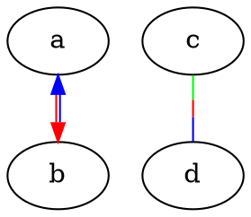

---
defaults:
- black
flags: []
minimums: []
name: color
types:
- color
- colorList
used_by: ENC
---
Basic drawing color for graphics, not text. For the latter, use the
[`fontcolor`](#d:fontcolor) attribute.

For edges, the value can either be a single color or a
[`colorList`](#k:colorList).

In the latter case, if `colorList` has no fractions,
the edge is drawn using parallel splines or lines,
one for each color in the list, in the order given.

The head arrow, if any, is drawn using the first color in the list,
and the tail arrow, if any, the second color. This supports the common
case of drawing opposing edges, but using parallel splines instead of
separately routed multiedges. 

If any fraction is used, the colors are drawn in series, with each color
being given roughly its specified fraction of the edge.

For example, the graph:

yields:

