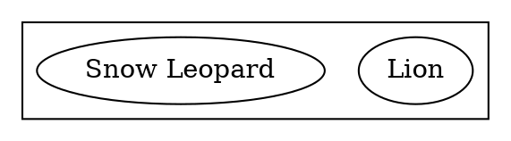

---
defaults:
- '""'
flags:
- svg
minimums: []
name: class
types:
- string
used_by: ENCG
---
Classnames to attach to the node, edge, graph, or cluster's SVG element.
Combine with [`stylesheet`](#d:stylesheet) for styling SVG output
using CSS classnames.

Multiple space-separated classes are supported.

Example:

