```dot
digraph {
        graph [bb="0,0,54,108"];
        node [label="\N"];
        a    [height=0.5,
             pos="27,90",
             width=0.75];
        b    [height=0.5,
             pos="27,18",
             width=0.75];
        a -> b  [pos="e,27,36.104 27,71.697 27,63.983 27,54.712 27,46.112"];
}
```

These formats produce output in the
[dot language](lang.html).
Using `canon` produces a prettyprinted version of the input,
with no layout performed.

The `dot` (and `gv` alias) options correspond to attributed dot output,
and is the default output format.
It reproduces the input, along with layout information for the graph.
In particular, a [`bb`]() attribute is
attached to the graph, specifying the bounding box of the drawing.
If the graph has a label, its position is specified by the
[`lp`]() attribute.

Each node gets [`pos`](),
[`width`]() and
the record rectangles are given in the
[`rects`]() attribute.
If the node is a polygon and the
[`vertices`]() attribute is defined, this
attribute contains the vertices of the node.

Every edge is
assigned a [`pos`]() attribute,
and if the edge has a label, the label position
is given in [`lp`]().

The `xdot` format extends the
`dot` format by providing much more detailed information about
how graph components are drawn. It relies on additional attributes
for nodes, edges and graphs.

The format is fluid; comments and
suggestions for better representations are welcome.
To allow for changes in the format, Graphviz attaches the attribute
`xdotversion` to the graph.
If the `xdotversion` attribute is set in the input graph, the renderer
will only output features supported by that version. Note that the formats `xdot1.2`
and `xdot1.4` are equivalent to setting `xdotversion=1.2` and `xdotversion=1.4`,
respectively.

Additional drawing attributes can appear on nodes, edges, clusters and
on the graph itself. There are six new attributes:

| Attribute | Description | Limitations |
| -------- | ------------------------------ | -- |
| `draw`   | General drawing without labels |    |
| `ldraw`  | Label drawing  |                    |
| `hdraw`  | Head arrowhead | Edge only |
| `tdraw`  | Tail arrowhead | Edge only |
| `hldraw` | Head label     | Edge only |
| `tldraw` | Tail label     | Edge only |

For a given graph object, one will typically issue a draw directive before the
label directive. For example, for a node, one would first use the commands
in `draw` followed by the commands in `ldraw`.

The value of these attributes consists of the concatenation of some
(multi-)set of the following 13 rendering or attribute operations.
(The number is parentheses gives the xdot version when the operation
was added to the format. If no version number is given, the operation
was in the original specification.)

E x₀ y₀ w h
: Filled ellipse ((x-x₀)/w)² + ((y-y₀)/h)² = 1

e x₀ y₀ w h
: Unfilled ellipse ((x-x₀)/w)² + ((y-y₀)/h)² = 1

P n x₁ y₁ ... xₙ yₙ
: Filled polygon using the given n points

p n x₁ y₁ ... xₙ yₙ
: Unfilled polygon using the given n points

L n x₁ y₁ ... xₙ yₙ
: Polyline using the given n points

B n x₁ y₁ ... xₙ yₙ
: B-spline using the given n control points

b n x₁ y₁ ... xₙ yₙ
: Filled B-spline using the given n control points (1.1)

T x y j w n -<I>b₁b₂...bₙ</I>
: Text drawn using the baseline point (x,y). The text consists of the
n bytes following `-`. The text should be left-aligned (centered,
right-aligned) on the point if j is -1 (0, 1), respectively. The value
w gives the width of the text as computed by the library.

t f
: Set font characteristics. The integer f is the OR of:

  | Flag | Value | Min-Version |
  | ---- | ----- | ----------- |
  | `BOLD` | 1 | |
  | `ITALIC` | 2 | |
  | `UNDERLINE` | 4 | |
  | `SUPERSCRIPT` | 8 | |
  | `SUBSCRIPT` | 16 | (1.5) |
  | `STRIKE_THROUGH` | 32 | (1.6) |
  | `OVERLINE` | 64 | (1.7) |

C n -<I>b₁b₂...bₙ</I>
: Set fill color. The color value consists of the
n bytes following `-`. (1.1)

c n -<I>b₁b₂...bₙ</I>
: Set pen color. The color value consists of the
n bytes following `-`. (1.1)

F s n -<I>b₁b₂...bₙ</I>
: Set font. The font size is s points. The font name consists of the
n bytes following `-`. (1.1)

S n -<I>b₁b₂...bₙ</I>
: Set style attribute. The style value consists of the
n bytes following `-`. The syntax of the value is the same as
specified for a **styleItem** in [style](/docs/attr-types/style/). (1.1)

I x y w h n -<I>b₁b₂...bₙ</I>
: Externally-specified image drawn in the box with lower left
corner (x,y) and upper right corner (x+w,y+h). The name of the image
consists of the n bytes following `-`. This is usually a bitmap
image. Note that the image size, even when converted from pixels to
points, might be different from the required size (w,h). It is
assumed the renderer will perform the necessary scaling. (1.2)

Note that the filled figures (ellipses, polygons and B-Splines)
imply two operations: first, drawing the filled figure with the
current fill color; second, drawing an unfilled figure with the
current pen color, pen width and pen style.

Within the context of a single drawing attribute, e.g., `draw`, there is
an implicit state for the graphical attributes. That is, once a color, style, font, or
font characteristic is set, it remains valid for all relevant drawing operations
until the value is reset by another xdot cmd.

Style values which can be incorporated in the graphics model do not
appear in xdot output. In particular, the style values
`filled`, `rounded`, `diagonals`, and `invis`
will not appear. Indeed, if style contains `invis`,
there will not be any xdot output at all.

With version 1.4 of xdot, color strings may now encode linear and radial gradients. Linear
gradients have the form <br>
&nbsp;&nbsp;&nbsp;&nbsp;'[' x₀ y₀ x₁ y₁ n [<I>color-stop</I>]⁺ ']'<br>
where (x₀,y₀) and (x₁,y₁) define the starting and
ending points of the gradient line segment, and n gives the number of <I>color-stops</I>. Each
<I>color-stop</I> has the form<br>
&nbsp;&nbsp;&nbsp;&nbsp;v m -<I>b₁b₂...bₘ</I><br>
where v is a number in the range [0,1] defining a position on the gradient line segment, with
color specified by the m byte string <I>b₁b₂...bₘ</I>,
the same format as used for colors in the 'c' and 'C' operations.

Radial gradients have the form<br>
&nbsp;&nbsp;&nbsp;&nbsp;'(' x₀ y₀ r₀ x₁ y₁ r₁ n [<I>color-stop</I>]⁺ ')' <br>
where x<i>ⱼ</i> y<i>ⱼ</i> r<i>ⱼ</i>, for <i>j</i>=0,1, specify
the center and radius of the start and ending circle, and n gives the number of _color-stops_.
A _color-stop_ has the same format as defined for linear gradients, again given the fractional
offset and its associated color.

In handling text alignment, the application may want to recompute the
string width using its own rendering primitives.

The text operation is only used in the label attributes. Normally,
the non-text operations are only used in the non-label attributes.
If, however, the [decorate]()
attribute is set on an edge, its label
attribute will also contain a polyline operation.
In addition, if a label is a complex, HTML-like label, it will also
contain non-text operations.

All coordinates and sizes are in points.
Note though that if
an edge or node is invisible, no drawing operations are attached to it.

Version info:

| Xdot version | Graphviz version | Modification
| ------------ | ---------------- | ------------
| >1.0         | 1.9
| >1.1         | 2.8              | First plug-in version
| >1.2         | 2.13             | Support image operator **I**
| >1.3         | 2.31             | Add numerical precision
| >1.4         | 2.32             | Add gradient colors
| >1.5         | 2.34             | Fix text layout problem; fix inverted vector in gradient; support version-specific output; new **t** op for text characteristics
| >1.6         | 2.35             | Add STRIKE-THROUGH bit for`t`
| >1.7         | 2.37             | Add OVERLINE for `t`


```
$ echo 'digraph { a->b }' | dot -Tcanon
```




```
$ echo 'digraph { a->b }' | dot -Tdot
```





```
$ echo 'digraph { a->b }' | dot -Txdot
```
```dot
digraph {
        graph [_draw_="c 9 -#fffffe00 C 7 -#ffffff P 4 0 0 0 108 54 108 54 0 ",
             bb="0,0,54,108",
             xdotversion=1.7
        ];
        node [label="\N"];
        a    [_draw_="c 7 -#000000 e 27 90 27 18 ",
             _ldraw_="F 14 11 -Times-Roman c 7 -#000000 T 27 86.3 0 7 1 -a ",
             height=0.5,
             pos="27,90",
             width=0.75];
        b    [_draw_="c 7 -#000000 e 27 18 27 18 ",
             _ldraw_="F 14 11 -Times-Roman c 7 -#000000 T 27 14.3 0 7 1 -b ",
             height=0.5,
             pos="27,18",
             width=0.75];
        a -> b  [_draw_="c 7 -#000000 B 4 27 71.7 27 63.98 27 54.71 27 46.11 ",
             _hdraw_="S 5 -solid c 7 -#000000 C 7 -#000000 P 3 30.5 46.1 27 36.1 23.5 46.1 ",
             pos="e,27,36.104 27,71.697 27,63.983 27,54.712 27,46.112"];
}

