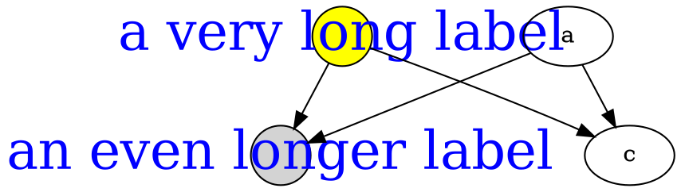

* Table of Contents
{:toc}

There are three main types of shapes :
[polygon-based](shapes.html#polygon),
[record-based](shapes.html#record) and
[user-defined](shapes.html#epsf).
The record-based shape has largely been superseded and greatly generalized
by [HTML-like labels](shapes.html#html).
That is, instead of using `shape=record`, one might
consider using `shape=none`, `margin=0` and an HTML-like label.

The geometry and style of all node shapes are affected by
the node attributes 
[`fixedsize`](attrs.html#d:fixedsize),
[`fontname`](attrs.html#d:fontname),
[`fontsize`](attrs.html#d:fontsize),
[`height`](attrs.html#d:height),
[`label`](attrs.html#d:label),
[`style`](#d:style) and
[`width`](attrs.html#d:width).

## Polygon-based Nodes {#polygon}

The possible polygon-based shapes are displayed below.


<figure class="gv-shape">
  <div class="gv-shape-img-container">
    
  </div>
  <figcaption class="gv-shape-caption"><code id="d:{{shape}}">{{shape}}</code></figcaption>
</figure>


As the figures suggest, the shapes `rect` and `rectangle` are synonyms for `box`, and `none` is a synonym for `plaintext`.
The shape `plain` is similar to these two, except that it also enforces
`width=0 height=0 margin=0`, which guarantees that the actual size of the node is entirely determined by the label.
This is useful, for example, when using [HTML-like labels](shapes.html#html).
Also, unlike the rest, we have shown these three, as well as `underline`,
without `style=filled`
to indicate the normal use. If fill were turned on, the label text would
appear in a filled rectangle.

The geometries of polygon-based shapes are also affected
by the node attributes 
[`regular`](attrs.html#d:regular),
[`peripheries`](attrs.html#d:peripheries) and
[`orientation`](attrs.html#d:orientation).
If `shape="polygon"`, the attributes
[`sides`](attrs.html#d:sides),
[`skew`](attrs.html#d:skew) and
[`distortion`](attrs.html#d:distortion) are also used.
If unset, they default to 4, 0.0 and 0.0, respectively.
The point shape is special in that it is
only affected by the [`peripheries`](attrs.html#d:peripheries),
[`width`](attrs.html#d:width) and
[`height`](attrs.html#d:height) attributes.

Normally, the size of a node is determined by smallest width and height
needed to contain its label and image, if any, with a margin specified by
the [`margin`](attrs.html#d:margin) attribute. The width
and height must also be at least as large as the sizes specified by the
[`width`](attrs.html#d:width) and
[`height`](attrs.html#d:height) attributes, which specify
the minimum values for these parameters. 
See the [`fixedsize`](attrs.html#d:fixedsize) attribute
for ways of restricting the node size.
In particular, if `fixedsize=shape`, the node's shape will be fixed
by the [`width`](attrs.html#d:width) and
[`height`](attrs.html#d:height) attributes, and the shape
is used for edge termination, but both the shape and label sizes are used
preventing node overlap. For example, the following graph:



yields the figure:


Note that the label of the yellow node, with `fixedsize=true`, overlaps
the other node, where there is sufficient space for the gray node with
`fixedsize=shape`.

The shapes: `note`, `tab`, `folder`,
`box3d` and `component` were provided by Pander.
The synthetic biology shapes:
`promoter`,
`cds`,
`terminator`,
`utr`,
`primersite`,
`restrictionsite`,
`fivepoverhang`,
`threepoverhang`,
`noverhang`,
`assembly`,
`signature`,
`insulator`,
`ribosite`,
`rnastab`,
`proteasesite`,
`proteinstab`,
`rpromoter`,
`rarrow`,
`larrow` and
`lpromoter`
were contributed by Jenny Cheng.

## Record-based Nodes {#record}

**NOTE:** Please see the note about record-based nodes at the
[top](#top) of this page. Also note that there are problems using
non-trivial edges (edges with ports or labels) between adjacent
nodes on the same rank if one or both nodes has a record shape.

These are specified by shape values of "record" and "Mrecord".
The structure of a record-based node is determined by 
its [`label`](attrs.html#d:label),
which has the following schema:

<TABLE>
<TR>
  <TD STYLE="text-align: right;"><I>rlabel</I></TD>
  <TD>=</TD>
  <TD><I>field</I> ( '|' <I>field</I> )*</TD>
</TR>
<TR>
  <TD STYLE="text-align: right;">where <I>field</I></TD>
  <TD>=</TD>
  <TD><I>fieldId</I> or '{' <I>rlabel</I> '}'</TD>
</TR>
<TR>
  <TD STYLE="text-align: right;">and <I>fieldId</I></TD>
  <TD>=</TD>
  <TD> [ '&lt;' <I>string</I> '&gt;'] [ <I>string</I> ]</TD>
</TR>
</TABLE>

Braces, vertical bars and angle brackets must be escaped with
a backslash character if you wish them to appear as a literal character.
Spaces are interpreted as separators between tokens,
so they must be escaped if you want spaces in the text.

The first string in _fieldId_ assigns a portname to the field and can
be combined with the node name to indicate where to attach an edge
to the node. (See [portPos](attrs.html#k:portPos).)
The second string is used as the text for the field; it supports the usual
[escape sequences](attrs.html#k:escString) `\n`, `\l` and `\r`.

Visually, a record is a box, with fields represented by alternating
rows of horizontal or vertical subboxes. The Mrecord shape is identical
to a record shape, except that the outermost box has rounded corners.
Flipping between horizontal and vertical layouts is done by nesting
fields in braces "{...}". The top-level orientation in a record is
horizontal. Thus, a record with label "A | B | C | D" will have 4 fields 
oriented left to right, while "{A | B | C | D}" will have them 
from top to bottom and "A | { B | C } | D" will have "B" over "C", with
"A" to the left and "D" to the right of "B" and "C".

The initial orientation of a record node depends on the
[rankdir](attrs.html#d:rankdir) attribute. If this attribute
is `TB` (the default) or `BT`, corresponding to vertical
layouts, the top-level fields in a record are displayed horizontally.
If, however, this attribute is `LR` or `RL`,
corresponding to horizontal layouts, the top-level fields are 
displayed vertically.

As an example of a record node, the dot input:

```dot
digraph structs {
    node [shape=record];
    struct1 [label="<f0> left|<f1> mid&#92; dle|<f2> right"];
    struct2 [label="<f0> one|<f1> two"];
    struct3 [label="hello&#92;nworld |{ b |{c|<here> d|e}| f}| g | h"];
    struct1:f1 -> struct2:f0;
    struct1:f2 -> struct3:here;
}
```



yields the figure:


If we add the line:

```
    rankdir=LR
```

we get the layout:


If we change node `struct1` to have shape `Mrecord`,
it then looks like:


## Styles for Nodes {#d:style}
The [`style`](attrs.html#d:style)
attribute can be used to modify the appearance of a node.
At present, there are 8 style values recognized:
`filled`, `invisible`, `diagonals`, `rounded`.
`dashed`, `dotted`, `solid` and `bold`.
As usual, the value of the [`style`](attrs.html#d:style)
attribute can be a comma-separated list of any of these. If the
style contains conflicts (e.g, `style="dotted, solid"`), the last
attribute wins.

{:#filled} `filled`
: This value indicates that the node's interior should be filled.
  The color used is the node's `fillcolor` or, if that's not defined, its
  `color`. For unfilled nodes, the interior of the node is transparent to
  whatever color is the current graph or cluster background color.
  Note that `point` shapes are always filled.

  Thus, the code:

  ```dot
  digraph G {
    rankdir=LR
    node [shape=box, color=blue]
    node1 [style=filled] 
    node2 [style=filled, fillcolor=red] 
    node0 -> node1 -> node2
  }
  ```

  yields the figure:

  

{:#d:invisible} `invisible`
: Setting this style causes the node not to be displayed at all.
  Note that the node is still used in laying out the graph.

{:#d:diagonals} `diagonals`
: The diagonals style causes small chords to be drawn near the vertices
  of the node's polygon or, in case of circles and ellipses, two chords near
  the top and the bottom of the shape. The special node shapes
  [`Msquare`](#d:Msquare),
  [`Mcircle`](#d:Mcircle), and
  [`Mdiamond`](#d:Mdiamond)
  are simply an ordinary square, circle and
  diamond with the diagonals style set.

{:#d:rounded} `rounded`
: The rounded style causes the polygonal corners to be smoothed.
  Note that this style also applies to record-based nodes. Indeed,
  the `Mrecord` shape is simply shorthand for setting this style.
  Also, prior to 26 April 2005, the rounded and filled styles were 
  mutually exclusive.

  As an example of rounding, dot uses the graph:

  ```dot
  digraph R {
    rankdir=LR
    node [style=rounded]
    node1 [shape=box]
    node2 [fillcolor=yellow, style="rounded,filled", shape=diamond]
    node3 [shape=record, label="{ a | b | c }"]

    node1 -> node2 -> node3
  }
  ```

  to produce the figure:

  

{:#d:dashed} `dashed`
: This style causes the node's border to be drawn as a dashed line.

{:#d:dotted} `dotted`
: This style causes the node's border to be drawn as a dotted line.

{:#d:solid} `solid`
: This style causes the node's border to be drawn as a solid line,
  which is the default.

{:#d:bold} `bold`
: This style causes the node's border to be drawn as a bold line.
  See also [penwidth](attrs.html#d:penwidth).

Additional styles may be available with a specific code generator.

## HTML-Like Labels {#html}

**NOTE:** This feature is only available on versions of Graphviz
that are newer than mid-November 2003. In particular, it is not part
of release 1.10.

**NOTE:** The font markups for bold, italic, underlining, subscript and 
superscript ([`<B>`](#b), [`<I>`](#i), [`<U>`](#u), [`<SUB>`](#sub) and [`<SUP>`](#sup)) 
are only available in versions after 14 October 2011, and 
the markup for strike-through ([`<S>`](#s)) requires versions later than 15 September 2013.
In addition, all of these markups are
currently only available via the cairo and svg renderers.
The horizontal and vertical rules ([`<HR>`](#hr) and [`<VR>`](#vr))
are only available in versions later than 8 July 2011.

**NOTE:** For releases later than 9 September 2014, one can use `shape=plain` so that the size
of the node is totally determined by the label. Otherwise, the node's margin, width and height values may cause the
node to be larger, so that edges are clipped away from the label. In effect, `shape=plain` is shorthand
for `shape=none width=0 height=0 margin=0`.

If the value of a label attribute
([`label`](attrs.html#d:label) for nodes, edges, clusters, and
graphs, and the
[`headlabel`](attrs.html#d:headlabel) and
[`taillabel`](attrs.html#d:taillabel)
attributes of an edge) is given as an
[HTML string](lang.html#html),
that is, delimited by `<...>`
rather than `"..."`,
the label is interpreted as
an HTML description. At their simplest, such labels
can describe multiple lines of variously aligned text as provided by ordinary 
[string labels](attrs.html#k:escString). More generally, the
label can specify a table similar to those provided by HTML,
with different graphical attributes at each level.

As [HTML strings](lang.html#html) are processed like HTML input, any use of
the `"`, `&`, `<`, and `>` characters in literal text or in attribute values
need to be replaced by the corresponding escape sequence. For example, if you want to
use `&` in an `href` value, this should be represented as `&amp;`.

**NOTE:** The features and syntax supported by these labels are
modeled on HTML. However, there are many aspects that are relevant
to Graphviz labels that are not in HTML and, conversely, HTML allows
various constructs which are meaningless in Graphviz. We will generally
refer to these labels as "HTML labels" rather than the cumbersome
"HTML-like labels" but the reader is warned that these are not really
HTML. The grammar below describes precisely what Graphviz will accept.

Although HTML labels are not, strictly speaking, a shape, they can be
viewed as a generalization of the record shapes described above. 
In particular, if a node has set its 
[`shape`](attrs.html#k:shape)
attribute to `none` or `plaintext`, the HTML label will be the node's
shape. On the other hand, if the node has any other shape (except 
`point`), the HTML label will be embedded within the node the
same way an ordinary label would be. Adding HTML labels to record-based shapes (record and Mrecord) is discouraged and may lead to unexpected behavior because of their conflicting label schemas and overlapping functionality.

The following is an abstract grammar for HTML labels.
Terminals, corresponding to elements, are shown in bold font,
and nonterminals in italics.
Square brackets `[` and `]` enclose optional items.
Vertical bars `|` separate alternatives.
Note that, as in HTML, element and attribute names are case-insensitive.
(cf. sections 3.2.1 and 3.2.2 of the 
[HTML 4.01 specification](http://www.w3.org/TR/html401)).

<TABLE>

</TABLE>

All non-printing characters such as tabs or newlines are ignored.
Above, a _string_ is any collection of printable characters, including
spaces. For tables, outside of the body of a [`<TD>`](#td) element,
whitespace characters are ignored, including spaces; within a [`<TD>`](#td) element, spaces
are preserved but all other white space characters are discarded.
**N.B.** For technical reasons, if a table is wrapped in a font element such as [`<FONT>`](#font)
or [`<B>`](#b), any space immediately before or after this will cause a syntax error. For example,
the label

```
< <U><TABLE><TR><TD>a</TD></TR></U>>
```

is not legal. Removing either the space or the `<U>...</U>` will fix this.

HTML comments are allowed within an HTML string. They can occur anywhere
provided that, if they contain part of an HTML element, they must contain
the entire element.

As is obvious from the above description, the interpretation of white space
characters is one place where HTML-like labels is very different from 
standard HTML. In HTML, any sequence of white space characters is 
collapsed to a single space, If the user does not want this to happen, the
input must use non-breaking spaces `&nbsp;`. This makes sense in
HTML, where text layout depends dynamically on the space available. In
Graphviz, the layout is statically determined by the input, so it is
reasonable to treat ordinary space characters as non-breaking. In addition,
ignoring tabs and newlines allows the input text to be formatted for
easier reading. 

Each of the HTML elements has a set of optional attributes.
Attribute values must appear in double quotes.

{:#table} Table element
: <pre>
  &lt;TABLE
    <a href="#align">ALIGN</a>="CENTER|LEFT|RIGHT"
    <a href="#bgcolor">BGCOLOR</a>=<I>color</I>"
    <a href="#border">BORDER</a>="<I>value</I>"
    <a href="#cellborder">CELLBORDER</a>="<I>value</I>"
    <a href="#cellpadding">CELLPADDING</a>="<I>value</I>"
    <a href="#cellspacing">CELLSPACING</a>="<I>value</I>"
    <a href="#color">COLOR</a>="<I>color</I>"
    <a href="#columns">COLUMNS</a>="<I>value</I>"
    <a href="#fixedsize">FIXEDSIZE</a>="FALSE|TRUE"
    <a href="#gradientangle">GRADIENTANGLE</a>="<I>value</I>"
    <a href="#height">HEIGHT</a>="<I>value</I>"
    <a href="#href">HREF</a>="<I>value</I>"
    <a href="#id">ID</a>="<I>value</I>"
    <a href="#port">PORT</a>="<I>portName</I>"
    <a href="#rows">ROWS</a>="<I>value</I>"
    <a href="#sides">SIDES</a>="<I>value</I>"
    <a href="#style">STYLE</a>="<I>value</I>"
    <a href="#target">TARGET</a>="<I>value</I>"
    <a href="#title">TITLE</a>="<I>value</I>"
    <a href="#tooltip">TOOLTIP</a>="<I>value</I>"
    <a href="#valign">VALIGN</a>="MIDDLE|BOTTOM|TOP"
    <a href="#width">WIDTH</a>="<I>value</I>"
  &gt;
  </pre>

{:#tr} Table row
: <PRE>&lt;TR
    &lt;!-- No attributes --&gt;
  &gt;
  </PRE>

{:#td} Table cell
: <PRE>
  &lt;TD
    <a href="#align">ALIGN</a>="CENTER|LEFT|RIGHT|TEXT"
    <a href="#balign">BALIGN</a>="CENTER|LEFT|RIGHT"
    <a href="#bgcolor">BGCOLOR</a>="<I>color</I>"
    <a href="#border">BORDER</a>="<I>value</I>"
    <a href="#cellpadding">CELLPADDING</a>="<I>value</I>"
    <a href="#cellspacing">CELLSPACING</a>="<I>value</I>"
    <a href="#color">COLOR</a>="<I>color</I>"
    <a href="#colspan">COLSPAN</a>="<I>value</I>"
    <a href="#fixedsize">FIXEDSIZE</a>="FALSE|TRUE"
    <a href="#gradientangle">GRADIENTANGLE</a>="<I>value</I>"
    <a href="#height">HEIGHT</a>="<I>value</I>"
    <a href="#href">HREF</a>="<I>value</I>"
    <a href="#id">ID</a>="<I>value</I>"
    <a href="#port">PORT</a>="<I>portName</I>"
    <a href="#rowspan">ROWSPAN</a>="<I>value</I>"
    <a href="#sides">SIDES</a>="<I>value</I>"
    <a href="#style">STYLE</a>="<I>value</I>"
    <a href="#target">TARGET</a>="<I>value</I>"
    <a href="#title">TITLE</a>="<I>value</I>"
    <a href="#tooltip">TOOLTIP</a>="<I>value</I>"
    <a href="#valign">VALIGN</a>="MIDDLE|BOTTOM|TOP"
    <a href="#width">WIDTH</a>="<I>value</I>"
  &gt;
  </PRE>

{:#font} Font specification
: <PRE>
  &lt;FONT
    <a href="#color">COLOR</a>="<I>color</I>"
    <a href="#face">FACE</a>="<I>fontname</I>"
    <a href="#point-size">POINT-SIZE</a>="<I>value</I>"
  &gt;
  </PRE>

{:#br} Line break
: <PRE>
  &lt;BR
    <a href="#align">ALIGN</a>="CENTER|LEFT|RIGHT"
  /&gt;
  </PRE>

{:#img} Image inclusion
: <PRE>
  &lt;IMG
    <a href="#scale">SCALE</a>="FALSE|TRUE|WIDTH|HEIGHT|BOTH"
    <a href="#src">SRC</a>="<I>value</I>"
  /&gt;
  </PRE>

{:#i} Italic style
: <PRE>
  &lt;I
    &lt;!-- No attributes --&gt;
  &gt;
  </PRE>

{:#b} Bold style
: <PRE>
  &lt;B
    &lt;!-- No attributes --&gt;
  &gt;
  </PRE>

{:#u} Underline text
: <PRE>
  &lt;U
    &lt;!-- No attributes --&gt;
  &gt;
  </PRE>

{:#o} Overline text
: <PRE>
  &lt;O
    &lt;!-- No attributes --&gt;
  &gt;
  </PRE>

{:#sub} Subscript text
: <PRE>
  &lt;SUB
    &lt;!-- No attributes --&gt;
  &gt;
  </PRE>

{:#sup} Superscript text
: <PRE>
  &lt;SUP
    &lt;!-- No attributes --&gt;
  &gt;
  </PRE>

{:#s} Strike-through text
: <PRE>
  &lt;S
    &lt;!-- No attributes --&gt;
  &gt;
  </PRE>

{:#hr} Horizontal rule
: <PRE>
  &lt;HR
    &lt;!-- No attributes --&gt;
  /&gt;
  </PRE>

{:#vr} Vertical rule
: <PRE>
  &lt;VR
    &lt;!-- No attributes --&gt;
  /&gt;
  </PRE>

{:#align} ALIGN
: specifies horizontal placement. When an object is allocated
  more space than required, this value determines where the extra space
  is placed left and right of the object.

  *   `CENTER` aligns the object in the center. (Default)
  *   `LEFT` aligns the object on the left.
  *   `RIGHT` aligns the object on the right.
  *   ([`<TD>`](#td) only) `TEXT` aligns lines of text using the full cell width. The alignment of a line is determined by its (possibly implicit) associated [`<BR>`](#br) element.

  The contents of a cell are normally aligned as a block. In particular,
  lines of text are first aligned as a text block based on the width of
  the widest line and the corresponding [`<BR>`](#br) elements. Then,
  the entire text block is aligned within a cell. If, however, the
  cell's **_ALIGN_** value is `TEXT`, and the cell contains
  lines of text, then the lines are justified using the entire available
  width of the cell. If the cell does not contain text, then the contained
  image or table is centered.

{:#balign} BALIGN
: specifies the default alignment of [`<BR>`](#br) elements contained
  in the cell. That is, if a [`<BR>`](#br) element has no
  explicit [**_ALIGN_**](#align) attribute, the attribute value is specified
  by the value of **_BALIGN_**.

{:#bgcolor} BGCOLOR="color"
: sets the color of the background. This color can be 
  overridden by a **_BGCOLOR_** attribute in descendents.
  The value can be a single color or two colors separated by a colon, the
  latter indicating a gradient fill.

{:#border} BORDER="value"
: specifies the width of the border around the object in points.
  A value of zero indicates no border. The default is 1.
  The maximum value is 255.
  If set in a table, and [**_CELLBORDER_**](#cellborder) is not set,
  this value is also used for all cells in the table.
  It can be overridden by a **_BORDER_** attribute in a cell.

{:#cellborder} CELLBORDER="value"
: specifies the width of the border for all cells in a table.
  It can be overridden by a [**_BORDER_**](#border) tag in a cell.
  The maximum value is 255.

{:#cellpadding} CELLPADDING="value"
: specifies the space, in points, between a cell's border and its content.
  The default is 2.
  The maximum value is 255.

{:#cellspacing} CELLSPACING="value"
: specifies the space, in points, between cells in a table and between
  a cell and the table's border.  The default is 2.
  The maximum value is 127.

{:#color} COLOR="color"
: sets the color of the font within the scope of
  [`<FONT>...</FONT>`](#font), or the border color
  of the table or cell within the scope of
  [`<TABLE>...</TABLE>`](#table),
  or [`<TD>...</TD>`](#td).
  This color can be 
  overridden by a **_COLOR_** attribute in descendents.
  By default, the font color is determined by the
  [fontcolor](attrs.html#d:fontcolor) attribute of
  the corresponding node, edge or graph, and the border color
  is determined by the
  [color](attrs.html#d:color) attribute of
  the corresponding node, edge or graph.

{:#colspan} COLSPAN="value"
: specifies the number of columns spanned by the cell. The default is 1.
  The maximum value is 65535.

{:#columns} COLUMNS="value"
: provides general formatting information concerning the columns.
  At present, the only legal value is `*`, which causes a vertical rule to
  appear between every cell in every row.

{:#face} FACE="fontname"
: specifies the font to use within the scope of
  [`<FONT>...</FONT>`](#font).
  This can be 
  overridden by a **_FACE_** attribute in descendents.
  By default, the font name is determined by the
  [fontname](attrs.html#d:fontname) attribute of the corresponding
  node, edge or graph.

{:#fixedsize} FIXEDSIZE
: specifies whether the values given by the [**_WIDTH_**](#width)
  and [**_HEIGHT_**](#height) attributes are enforced.

  *   FALSE allows the object to grow so that all its contents will fit. (Default)
  *   TRUE fixes the object size to its given [**_WIDTH_**](#width) and [**_HEIGHT_**](#height). Both of these attributes must be supplied.

{:#gradientangle} GRADIENTANGLE="value"
: gives the angle used in a gradient fill if the 
  [**_BGCOLOR_**](#bgcolor) is a color list. For the default linear gradient,
  this specifies 
  the angle of a line through the center along which the colors transform.
  Thus, an angle of 0 will cause a left-to-right progression.
  For radial gradients (see [**_STYLE_**](#style)), the angle specifies the position
  of the center of the coloring. An angle of 0 places the center at the center of the
  table or cell; an non-zero angle places the fill center along that angle near the
  boundary.

{:#height} HEIGHT="value"
: specifies the mininum height, in points, of the object. The height
  includes the contents, any spacing and the border. Unless
  [**_FIXEDSIZE_**](#fixedsize) is true, the height will be expanded to allow
  the contents to fit.
  The maximum value is 65535.

{:#href} HREF="value"
: attaches a URL to the object.
  Note that the `"value"` is treated as an
  [escString](attrs.html#k:escString) similarly to the
  [URL](attrs.html#d:URL) attribute.

{:#id} ID="value"
: allows the user to specify a unique ID for a table or cell. See
  the [id](attrs.html#d:id) attribute for more information.
  Note that the `"value"` is treated as an
  [escString](attrs.html#k:escString) similarly to the
  [id](attrs.html#d:id) attribute.

{:#point-size} POINT-SIZE="value"
: sets the size of the font, in points, used within the scope of
  `<FONT>...</FONT>`.
  This can be 
  overridden by a **_POINT-SIZE_** attribute in descendents.
  By default, the font size is determined by the
  [fontsize](attrs.html#d:fontsize) attribute of the corresponding
  node, edge or graph.

{:#port} PORT="value"
: attaches a portname to the object.
  (See [portPos](attrs.html#k:portPos).)
  This can be used to modify the head
  or tail of an edge, so that the end attaches directly to the object.

{:#rows} ROWS="value"
: provides general formatting information concerning the rows.
  At present, the only legal value is `*`, which causes a horizontal rule to
  appear between every row.

{:#rowspan} ROWSPAN="value"
: specifies the number of rows spanned by the cell. The default is 1.
  The maximum value is 65535.

{:#scale} SCALE
: specifies how an image will use any extra space available in its cell.
  Allowed values are
  *   `FALSE` : keep image its natural size. (Default)
  *   `TRUE` : scale image uniformly to fit.
  *   `WIDTH` : expand image width to fill
  *   `HEIGHT` : expand image height to fill
  *   `BOTH` : expand both image width height to fill
  If this attribute is undefined, 
  the image inherits the [imagescale](attrs.html#d:imagescale)
  attribute of the graph object being drawn.
  As with the [imagescale](attrs.html#d:imagescale)
  attribute, if the cell has a fixed size and the image is too large,
  any offending dimension will be shrunk to fit the space, the
  scaling being uniform in width and height if _SCALE=`"true"`_.
  Note that the containing cell's [**_ALIGN_**](#align)
  and [**_VALIGN_**](#valign) attributes override
  an image's [**_SCALE_**](#scale) attribute.

{:#sides} SIDES="value"
: specifies which sides of a border in a cell or table should be drawn, if
  a border is drawn. By default, all sides are drawn. The `"value"`
  string can contain any collection of the (case-insensitive) 
  characters `'L'`, `'T'`, `'R'`, or `'B'`,
  corresponding to the left, top, right and, bottom sides of the border,
  respectively. For example, `SIDES="LB"` would indicate only the
  left and bottom segments of the  border should be drawn.

{:#src} SRC="value"
: specifies the image file to be displayed in the cell.
  Note that if the software is used as a web server, file system access
  to images is more restricted. See [GV\_FILE\_PATH](command.html#d:GV_FILE_PATH)
  and [SERVER_NAME](command.html#d:SERVER_NAME).

{:#style} STYLE
: specifies style characteristics of the table or cell. Style characteristics are
  given as a comma or space separated list of style attributes. At present, the only
  legal attributes are `ROUNDED` and `RADIAL` for tables, and `RADIAL` for cells.
  If `ROUNDED` is specified, the table will have rounded corners.
  This probably works best if the outmost cells have no borders, or their [`CELLSPACING`](#cellspacing)
  is sufficiently large.
  If it is desirable to have borders around the cells, use [_**HR**_](#hr)
  and [_**VR**_](#vr) elements, or the [_**COLUMNS**_](#columns) and [_**ROWS**_](#rows) attributes of [_**TABLE**_](#table).

  The `RADIAL` attribute indicates a radial gradient fill. See the [**_BGCOLOR_**](#bgcolor) and
  [**_GRADIENTANGLE_**](#gradientangle) attributes.

{:#target} TARGET="value"
: determines which window of the browser is used for the URL if the object 
  has one. 
  See [W3C documentation](http://www.w3.org/TR/html401/present/frames.html#adef-target).
  Note that the `"value"` is treated as an
  [escString](attrs.html#k:escString) similarly to the
  [target](attrs.html#d:target) attribute.

{:#title} TITLE="value"
: sets the tooltip annotation attached to the element. 
  This is used only if the element has a [`HREF`](#href) attribute.
  Note that the `"value"` is treated as an
  [escString](attrs.html#k:escString) similarly to the
  [tooltip](attrs.html#d:tooltip) attribute.

{:#tooltip} TOOLTIP="value"
: is an alias for [**_TITLE_**](#title).

{:#valign} VALIGN
: specifies vertical placement. When an object is allocated
  more space than required, this value determines where the extra space
  is placed above and below the object.

  *   `MIDDLE` aligns the object in the center. (Default)
  *   `BOTTOM` aligns the object on the bottom.
  *   `TOP` aligns the object on the top.

{:#width} WIDTH="value"
: specifies the mininum width, in points, of the object. The width
  includes the contents, any spacing and the border. Unless
  [**_FIXEDSIZE_**](#fixedsize) is true, the width will be expanded to allow
  the contents to fit.
  The maximum value is 65535.

There is some inheritance among the attributes. If a table specifies
a [_**CELLPADDING**_](#cellpadding), [_**CELLBORDER**_](#cellborder) or [_**BORDER**_](#border)
value, this value is used by the table's
cells unless overridden. If a cell or table specifies a _**BGCOLOR**_,
this will be the background color for all of its descendents.
Of course, if a background or fill color is specified for the
graph object owning the label, this will be the original
background for the label.
The object's fontname, fontcolor and fontsize attributes
are the default for drawing text. These can be overridden by using
[_**FONT**_](#font) to set new values. The new font values will hold
until overridden by an enclosed [_**FONT**_](#font) element.
Finally, the pencolor or color of the graph object will be used as
the border color.

If you want horizontal or vertical rules used uniformly within a table, consider
using the [_**COLUMNS**_](#columns) or [_**ROWS**_](#rows) attributes
rather than using many
[_**HR**_](#hr) and [_**VR**_](#vr) elements.

Because of certain limitations in handling tables in a device-independent
manner, when [_**BORDER**_](#border) is 1 and both table and cell borders
are on and [_**CELLSPACING**_](#cellspacing) is less than 2, anomalies can arise
in the output, such as gaps between sides of borders which should be
abutting or even collinear. The user can usual get around this by increasing
the border size or the spacing, or turning off the table border.

### HTML-Like Label Examples

#### Recreating the Record Example

The dot input:

```dot

```

produces the HTML analogue of the record example above:


As usual, an HTML specification is more verbose.

#### More Complex Example

On the other hand, HTML labels are much more general:

```dot

```

produces:


#### Fonts Example
An example using [`<FONT>`](#font) elements:

```dot

```

produces:


#### Images Example

Using an [``](#img) element:

```dot

```

produces:


#### Sides Example

The [`sides`](#sides) attribute (version 2.37 and later) allows one to combine cells to form
various non-convex shapes. For example, a `tee-shaped` node

```dot
  tee [shape=none margin=0 label=
    <<table border="0" cellspacing="0" cellborder="1">
     <tr>
      <td width="9" height="9" fixedsize="true" style="invis"></td>
      <td width="9" height="9" fixedsize="true" sides="ltr"></td>
      <td width="9" height="9" fixedsize="true" style="invis"></td>
     </tr>
     <tr>
      <td width="9" height="9" fixedsize="true" sides="tlb"></td>
      <td width="9" height="9" fixedsize="true" sides="b"></td>
      <td width="9" height="9" fixedsize="true" sides="brt"></td>
     </tr>
    </table>>]
```

produces:


## User-defined Node Shapes {#epsf}

There is a third type of node shape which is specified by the user.
Typically, these shapes rely on the details of a concrete graphics
format. At present, shapes can be described using PostScript, via a
file or add-on library, for use in PostScript output, or shapes can
be specified by a bitmap-image file for use with SVG or bitmap (jpeg,
gif, etc.) output. More information can be found on the page 
[How to create custom shapes](../../../faq/#FaqCustShape).

## SDL Shapes for PostScript {#sdlshapes}
One example of user-defined node shapes is provided by Mark Rison of CSR.
These are the [SDL](http://www.sdl-forum.org/SDL/index.htm) shapes.
These are available as PostScript functions whose use is described in
[External PostScript procedures](../../../faq/#ext_ps_proc).
The necessary PostScript library file and sample use can be found in the
`contrib/sdlshapes` directory in the release. Please note the
COPYRIGHT AND PERMISSION NOTICE contained in the library file `sdl.ps`.

The table below
gives the shape names and the corresponding node shapes:


