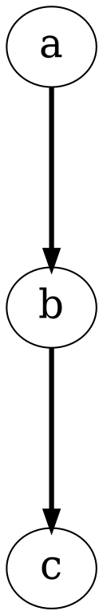
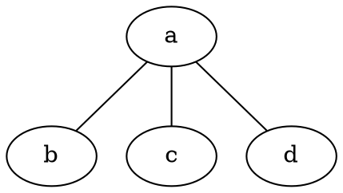
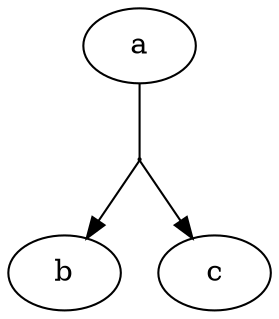
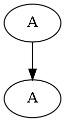
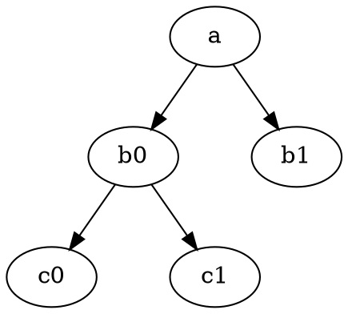
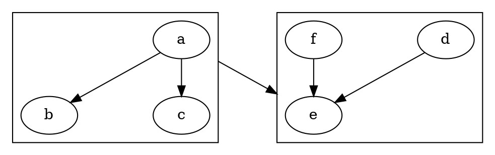
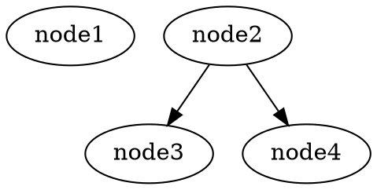

         
If you cannot find the answer to your question here, ask it in the [Graphviz forum](https://forum.graphviz.org).


## Contributions

* [FaqToDo](/doc/todo.html) Our TODO list
* [FaqPSdefs](/Documentation/html/isofonts.txt) PostScript defs for ISO-latin1 fonts (by [Enrique Vidal](mailto:evidal@iti.upv.es))

## General

 * [FaqAttr](#FaqAttr) Where can I see a list of all the attributes that control dot or neato?
 * [FaqDiscuss](#FaqDiscuss) Where can I discuss Graphviz?
 * [FaqLarger](#FaqLarger) I'm trying to make a layout larger. How?
 * [FaqMerge](#FaqMerge) How can I join or merge certain edge routes in dot?
 * [FaqPDF](#FaqPDF) How can I generate graph layouts in PDF?
 * [FaqDupNode](#FaqDupNode) How can I make duplicate nodes?
 * [FaqGraphLabel](#FaqGraphLabel) How can I set a graph or cluster label without its propagating to all sub-clusters?
 * [FaqParEdge](#FaqParEdge) How can I draw multiple parallel edges in neato?
 * [FaqBalanceTree](#FaqBalanceTree) How can I symmetrize (balance) tree layouts?
 * [FaqCommandLine](/doc/info/command.html) What is the Graphviz command line syntax?
 * [FaqUserTypes](#FaqUserTypes) What user types does Graphviz support?
 * [FaqBugReport](#FaqBugReport) How can I report a bug or issue I've found?

## Clusters

 * [FaqClusterEdge](#FaqClusterEdge) How can I create edges between cluster boxes?
 * [FaqClusterHardToSee](#FaqClusterHardToSee) Clusters are hard to see.

## Output

 * [FaqQuality](#FaqQuality) How can I get high quality (antialiased) output?
 * [FaqPaperTooLarge](#FaqPaperTooLarge) I can only get 11x17 output?
 * [FaqSymbols](#FaqSymbols) How do I create special symbols and accents in labels?
 * [FaqNonAscii](#FaqNonAscii) More generally, how do I use non-ASCII character sets?
 * [FaqCustShape](#FaqCustShape) How can I create custom shapes?
 * [FaqOverlays](#FaqOverlays) How can I use drawing layers (overlays)?
 * [FaqFontChanges](#FaqFontChanges) How do I get font and color changes in record labels or other labels?
 * [FaqPlainArrows](#FaqPlainArrows) In plain format, splines do not touch the nodes (arrowheads are missing).
 * [FaqRecordLR](#FaqRecordLR) Record nodes are drawn differently in dot and neato when rankdir=LR.
 * [FaqMultiPage](#FaqMultiPage) How can I print a big graph on multiple pages?
 * [FaqJpgArtifacts](#FaqJpgArtifacts) When I have a red edge it shows up as a solid red in PNG and GIF formats, but has a black border when rendered to JPEG.
 * [FaqDottyNumlock](#FaqDottyNumlock) Sometimes in dotty, right mouse click shows the global menu but none of the items can be selected.
 * [FaqDottySyntaxError](#FaqDottySyntaxError) Why does dotty report a syntax error on a legal dot file?
 * [FaqNoEdgeHandles](#FaqNoEdgeHandles) How can I get rid of the little circles on edges ("edge handles") in dotty?
 * [FaqDotWithCoords](#FaqDotWithCoords) I already have all the coordinates for the nodes and edges of my graph and just want to use dot, neato, or dotty to render it. How?
 * [FaqDotWithNodeCoords](#FaqDotWithNodeCoords) I already have all the coordinates for the nodes, and I want dot or neato to route the edges.
 * [FaqDottyWithCoords](#FaqDottyWithCoords) I already have all the coordinates for the nodes and edges of my graph and just want to use dotty to render it. How?
 * [FaqDottyWithNodeCoords](#FaqDottyWithNodeCoords) Same as above, but I have only node coords, not edges.
 * [FaqClientSideMaps](#FaqClientSideMaps) How can I make client-side image maps?
 * [FaqServerSideMaps](#FaqServerSideMaps) Why aren't my server-side maps being recognized? I've checked the HTML!
 * [FaqApache](#FaqApache) I've installed Debian Graphviz and it works just fine on the command line, but when I execute a Perl/CGI script through Apache, no output is generated.
 * [Faq3D](#Faq3D) How can I get 3D output?


## Problems

 * [FaqOverlapNode](#FaqOverlapNode) How can I avoid node overlaps in neato?
 * [FaqOverlapEdge](#FaqOverlapEdge) How can I avoid node-edge overlaps in neato?
 * [FaqAgreadCrash](#FaqAgreadCrash) Why does my call to agread() cause a crash?
 * [FaqRuntimeNeato](#FaqRuntimeNeato) Neato runs forever on a certain example.
 * [FaqEdgeLabelPlace](#FaqEdgeLabelPlace) Edge label placement in dot is bad, or the layout is very convoluted.
 * [FaqRuntimeDot](#FaqRuntimeDot) Dot runs forever on a certain example.
 * [FaqRuntimeTwopi](#FaqRuntimeTwopi) Twopi runs forever on a certain example.
 * [FaqNeatoEdgeCrossings](#FaqNeatoEdgeCrossings) Neato has unnecessary edge crossings, or has missed an obvious chance to make a much nicer layout.
 * [FaqWebdot](#FaqWebdot) Webdot doesn't work.
 * [FaqFontNotFound](#FaqFontNotFound) I have "Font not found" errors, or text labels missing in webdot.

<!---
 * [FaqBrowserSVG](#FaqBrowserSVG) My browser doesn't recognize SVG.
--->
 * [FaqLibExpat](#FaqLibExpat) libexpat is reported as containing a virus or as a security hole. Is this a real problem?
 * [FaqCoordTransformation](#FaqCoordTransformation) What is the coordinate transformation between the graph bb and a .png image?

---


### <a name="FaqAttr"></a>Where can I see a list of all the attributes that control dot or neato?

See [Graph Attributes](/doc/info/attrs.html). There is also information on
[command-line usage](/doc/info/command.html) and [output
formats](/doc/info/output.html).

### <a name="FaqDiscuss"></a>Where can I discuss Graphviz?

Post questions and comments in the [Graphviz forum](https://forum.graphviz.org)

### <a name="FaqLarger"></a>I'm trying to make a layout larger. How?

There are various ways to increase the size of a layout. In doing this, one has to decide if the sizes of the nodes and text should be increased as well.

One approach is to adjust individual parameters such as fontsize, nodesep and ranksep. For example,



If you do this, make sure you are not fighting a conflicting graph size 
setting, like `size="6,6"`, which will then scale everything back down.

If you are using fdp or neato, increasing the edge len will tend to expand the layout.



For twopi and circo, there are other parameters such as `ranksep` which can be 
used. See the [graph attributes](/doc/info/attrs.html).

You can also use the `ratio` attribute. If you set the `size` attribute to the 
desired drawing size, and then set `ratio=fill`, node positions are scaled 
separately in x and y until the drawing fills the specified size. Note that 
node sizes stay the same. If, instead, you set `ratio=expand`, the layout is 
uniformly scaled up in x and y until at least one dimension fits size.

If you specify the `size` attribute but end it with an exclamation mark (!), 
the final drawing will be scaled up uniformly in x and y until at least one 
dimension fits size. Note that everything is scaled up, including text and 
node sizes.

If you're using PostScript, you can just scale up the output by manually 
adding a command such as `2 2 scale` where the PostScript environment is set 
up. Make sure to adjust the BoundingBox too if your tools look at this header.

### How can I join or merge certain edge routes in dot? {#FaqMerge}

You can try running `dot -Gconcentrate=true` or you can introduce your own virtual nodes drawn as tiny circles where you want to split or join edges:



### How can I generate graph layouts in PDF? {#FaqPDF}

If your version of Graphviz has cairo/pango support, you can just use the `-Tpdf` flag.
Unfortunately, this does not handle embedded links.

If you need embedded links, or don't have cairo/pango,
create PostScript output, then use an external converter from PostScript to PDF. 
For example, `dot -Tps | epsf2pdf -o file.pdf`. Note that URL tags are respected, to allow clickable PDF objects.

If your intention is to use the figure as PDF in some document preparation system, such as pdflatex, 
it is very important to use `-Tps2` rather than `-Tps`. In general, if you really want PDF output, that is, 
you would like to have a `-Tpdf` flag, use `-Tps2` before converting to PDF.

In the diagram below, the shaded nodes will contain bad output.


### How can I make duplicate nodes? {#FaqDupNode}

Make unique nodes with duplicate labels.



### How can I set a graph or cluster label without its propagating to all sub-clusters? {#FaqGraphLabel}

Set the label at the end of the graph (before the closing brace), after all its contents have been defined. 
(We admit it seems desirable to define some special syntax for non-inherited attribute settings.)

### How can I draw multiple parallel edges in neato? {#FaqParEdge}

When the splines attribute is false, which is the default, multiedges are drawn as a spindle of simply curved edges. There is no attempt to avoid intervening nodes.

When splines=true or polyline, multiedges are drawn as roughly parallel splines or polylines. This relies on there being no node overlaps.

An additional trick which is sometimes sufficient is to specify multiple colors for the edge using a color list. This will a produce set of 
tightly parallel splines, each in its specified color. Read about the [color attribute](/doc/info/colors.html) for more information.

### How can I symmetrize (balance) tree layouts? {#FaqBalanceTree}

When a tree node has an even number of children, it isn't necessarily centered above the two middle ones. 
If you know the order of the children, a simple hack is to introduce new, invisible middle nodes to re-balance the layout. 
The connecting edges should also be invisible. For example:



This trick really ought to be built into our solver (and made independent of the order of the children, and available for layouts other than trees, too).

### How can I report a bug or issue I've found? {#FaqBugReport}

You can report or view Graphviz bugs and issues by visiting the Graphviz <a href="https://gitlab.com/graphviz/graphviz/issues" target="_blank">Issues</a> page.

### How can I create edges between cluster boxes? {#FaqClusterEdge}

This only works in Graphviz version 1.7 and higher. To make edges between clusters, first set the graph attribute `compound=true`. 
Then, you can specify a cluster by name as a logical head or tail to an edge. This will cause the edge joining the two nodes to be 
clipped to the exterior of the box around the given cluster.

For example,



has an edge going from `cluster_A` to `cluster_B`. If, instead, you say

```dot
a -> e [ltail=cluster_A];
```

this gives you an edge from `cluster_A` to node `e`. Or you could just specify an `lhead` attribute. The program warns if a cluster specified as a logical 
node is not defined. Also, if a cluster is specified as a logical head for an edge, the real head must be contained in the cluster, and the 
real tail must not be. A similar check is done for logical tails. In these cases, the edge is drawn between the real nodes as usual.

### Clusters are hard to see. {#FaqClusterHardToSee}

Set `bgcolor=grey` (or some other color) in the cluster.

### How can I get high quality (antialiased) output? {#FaqQuality}

The easiest thing is to use a vector-based output formats such as PDF, SVG or PostScript. In addition, if Graphviz has a cairo/pango backend,  
this will generate anti-aliased output.

Anoher approache is to make the layout in PostScript (option `-Tps`), then run through Ghostview with antialiasing enabled. The important command line 
options are:

  *  -dTextAlphaBits=4 
  *  -dGraphicsAlphaBits=4 (4 is the highest level of antialiasing allowed - see the Ghostview documentation). 

The full command line to render a raster could be something like:

```bash
$ gs -q -dNOPAUSE -dBATCH -dTextAlphaBits=4 -dGraphicsAlphaBits=4 -sDEVICE=png16m -sOutputFile=file.png file.ps
```

On Mac OS X, the pixelglow port uses Apple's Quartz renderer, which enables antialiasing. It also provides a beautiful document container for its user interface. 
(One downside is that you can't run Pixelglow Graphviz as a web server or other background process if your Mac has 3D graphics, because Quartz wants 
to get this resource to accelerate rendering.)

### I can only get 11x17 output? {#FaqPaperTooLarge}

It's not us! It's probably your printer setup. If you don't believe this, run `dot -Tps` and look at the BoundingBox header. The coords are in 1/72ths of an inch.

### How do I create special symbols and accents in labels? {#FaqSymbols}

Use UTF8 coding, e.g. &#165; for the Yen currency symbol ¥. Example:

```dot
graph G {
  yen [label="&#165;"]
}
```



You can look up other examples in this handy [character set reference](/doc/char.html).

### More generally, how do I use non-ASCII character sets? {#FaqNonAscii}

The following applies to Graphviz 2.8 and later. (In older versions of Graphviz, you can sometimes get away with simply putting 
Latin-1 or other UTF-8 characters in the input stream, but the results are not always correct.)

Input: the general idea is to find the [Unicode](http://en.wikipedia.org/wiki/Unicode) 
value for the glyph you want, and enter it within a text string "...." or HTML-like label <...>.

For example, the mathematical forall sign (∀) has the value 0x2200. There are several ways this can be inserted into a file. One is to 
write out the ASCII representation: "&#&lt;nnn&gt;;" where &lt;nnn&gt; is the decimal representation of the value. The decimal value of 0x2200 is 8704, 
so the character can be specified as "&#8704;" . Alternatively, Graphviz accepts UTF-8 encoded input. In the case of forall, 
its UTF-8 representation is 3 bytes whose decimal values are 226 136 128. For convenience, you would probably enter this using your favorite 
editor, tuned to your character set of choice. You can then use the iconv program to map the graph from your character set to UTF-8 or Latin-1.

We also accept the HTML symbolic names for Latin-1 characters as suggested in [FaqSymbols](#FaqSymbols). 
For example, the cent sign (unicode and Latin-1 value decimal 162 can be inserted as `&cent;]

Note that the graph file must always be a plain text document not a Word or other rich format file. Any characters not 
enclosed in "..." or <...> must be ordinary ASCII characters. In particular, all of the DOT keywords such as digraph or subgraph must be ASCII.

Because we cannot always guess the encoding, you should set the graph attribute `charset` to [UTF-8](http://en.wikipedia.org/wiki/UTF-8), 
[Latin1](http://en.wikipedia.org/wiki/Latin-1) (alias ISO-8859-1 or ISO-IR-100) or 
[Big-5](http://en.wikipedia.org/wiki/Big-5) for Traditional Chinese. This can be done in the graph file or on the command line. For example `charset=Latin1`.

Output: It is essential that a font which has the glyphs for your specified characters is available at final rendering time. The choice of this font depends 
on the target code generator. For the gd-based raster generators (PNG, GIF, etc.) you need a TrueType or Type-1 font file on the machine running the Graphviz program. 
If Graphviz is built with the fontconfig library, it will be used to find the specified font. Otherwise, Graphviz will look in various default directories 
for the font. The directories to be searched include those specified by the `fontpath` attribute, related environment or shell 
variables (see the fontpath entry), and known system font directories. The [table](/doc/char.html) points out that these glyphs are from the times.ttf font. 
With fontconfig, it's hard to specify this font. Times usually gets resolved to Adobe Type1 times, which doesn't have all the glyphs seen on that page.)

For PostScript, the input must be either the ASCII subset of UTF-8 or Latin-1. (We have looked for more general solutions, but it appears that UTF-8 
and Unicode are handled differently for every kind of font type in PostScript, and we don't have time to hack this case-by-case.

For SVG output, we just pass the raw UTF-8 (or other encoding) straight through to the generated code.

### How can I create custom shapes? {#FaqCustShape}

One approach is to use [HTML-like labels](/doc/info/shapes.html#html) possibly combined with embedded images use the `IMG` attribute.

As alluded to in the [dot user's guide](/pdf/dotguide.pdf), if you want truly custome shape, there are several ways to incorporate this.
At this point, they either must be in PostScript or 
image files, or you'll need to modify the source code. A serious problem is that you can't make custom shapes that work across all the drivers and the interactive front-ends 
such as dotty or Grappa. At least SVG has interactive renderers, and PostScript can be translated to PDF which also has some interactive features.

<a name="ext_image"></a>**External image files**

If using SVG (`-Tsvg`), PostScript (`-Tps,-Tps2`) or one of the raster formats (`-Tgif, -Tpng, or -Tjpg`), you can load certain images (e.g., pictures) by file name into 
nodes. For example:

```dot
   yournode [image="yourface.gif"];
```

indicates the contents of the node are given in the GIF file `yourface.gif`. The [image](/doc/info/attrs.html#dimage) attribute specifies which file to use. 
(There is also the deprecated [shapefile](/doc/info/attrs.html#dshapefile) 
attribute. This is similar to image but the node shape will always be a box.)

*NOTE: In versions before 11 March 2006, in particular, 1.12 graphviz and earlier, it is necessary to also set the attribute shape=custom.*

With `-Tsvg`, `image` must give the name of a file containing a GIF, PNG or JPEG bitmap file. Note that the file's contents are not copied into the SVG output, 
only the files name. Thus, for Graphviz SVG output to display correctly, the image file must be available to the SVG viewer.

With PostScript, `image` must give the name of a file containing encapsulated PostScript or a bitmap. The contents are copied into the output file. Note that 
encapsulated PostScript will only be copied in once. The restrictions on the contents of the image are the same as those specified below under 
[External PostScript files](#ext_ps_file).

For bitmap output, `image` is a file name containing a bitmap image. The file is opened and copied (and possibly scaled) into the output drawing.

This code is still preliminary, and we have noted some problems with color quantization in indexed color map management that we are trying to understand and correct. (You can use -Gtruecolor=1 to try a 32 bit internal canvas as an alternative, but we have observed fuzziness (lossiness?) in the images.)

When the software is used as a web server, access to image files is more restrictive. See GV_FILE_PATH and SERVER_NAME.

<a name="ext_ps_file"></a>**External PostScript files**

If using the PostScript driver (`-Tps`) you can import node shapes as external PostScript files such as EPS (Encapsulated PostScript). At a minimum, the external 
file must have a valid BoundingBox header and not do drastic things to the graphics state since we don't install a wrapper for example to inhibit showpage.

To import an external PostScript file, set the `shape` and `shapefile` attributes as shown here:

```dot
	somenode  [shape=epsf, shapefile="yourfile.ps" ];
```

An EPSF shape is always clipped to its bounding box.

The use of `[shape=epsf, shapefile="yourfile.ps" ]` is largely superceded by the mechanism described in the previous section, using `[image="yourfile.ps" ]`.

<a name="ext_ps_proc"></a>**External PostScript procedures**

If using the PostScript driver (`dot -Tps`), you can define a PostScript procedure for shape drawing. The procedure must be able to draw variable-sized shapes. 
A file containing the definition can be loaded as a command line argument using the -l flag:

```bash
	$ dot  -Tps -l yourPS.ps  file.dot -o file.ps
```

In the graph file, invoke the shape like this:

```dot
	somenode [shape=yourshape]
```

In file.ps, for non-filled nodes, the procedure for `yourshape` will be called like this:

```
[ 54 36 0 36 0 0 54 0 54 36 ]  4 false yourshape
```

where the current color is the node's pencolor. The array contains the shape's bounding polygon, with the first point repeated at the end, followed by the number of 
points. At present, the shape is always a rectangle. From left to right, the points in the array always go counterclockwise, starting with 
the upper-right vertex. The boolean value after the number of vertices, here `false`, is the value of the node's `fill` attribute. The coordinates are 
absolute canvas coordinates.

For nodes with `fill=true`, the above invocation of `yourshape` will be preceded by

```
[ 54 36 0 36 0 0 54 0 54 36 ]  4 true yourshape
```

where the current color is the node's `fillcolor`.

*NOTE: In versions before 23 September 2005, yourshape is only invoked once, with the node's fill value and with the color set to the node's pencolor.*

For example, here are the contents of a plausible shape file, DFD.ps, which can be invoked by [shape=DFDbox]

```PostScript
	/xdef {exch def} bind def
	/DFDbox {
		10 dict begin
			/fflag xdef
			/sides xdef
			fflag   % if shape is filled
			{
				aload pop
				newpath
				moveto
				1 1 sides { pop lineto } for
				closepath fill
			}
			{
				aload pop
				% draw the sides
				newpath
				moveto
				1 1 sides {
					2 mod 0 ne
					{moveto} % even sides
					{lineto currentpoint stroke moveto} % odd sides
					ifelse
				} for
            }
			ifelse
		end
	} bind def
```

A custom shape of this kind is always clipped to its bounding box. It would not be hard to create a hook in the function user_shape() in shapes.c to determine clipping 
polygons other than rectangles (maybe) in case someone wants to try this and contribute the code for this.

Note that, by default, the bounding box is drawn around the contents and the node label is drawn. If you wish to eliminate these, set `label=""` and `peripheries=0` in the node.

**Driver-independent custom shapes**

If not using PostScript, you'll need to roll up your sleeves and modify the source. None of the other code generators support custom node shapes directly. 
If the custom shape is to be high-level and driver-independent, then you can add shape-specific functions (methods) to shapes.c with a corresponding entry in the 
array Shapes[] that maps shape names to methods. The method interfaces are described in the comment header in this file. Methods must be defined to initialize a 
shape (typically to size it big enough to fit its text label), bind a port name to a coordinate, test if a point is inside an instance of the 
shape (for edge clipping), generate code for the shape via the functions provided in the gvrender_engine_t structure, and return a box path to reach 
ports on the interior of a node (if they can exist).

More information on the functions available via gvrender_engine_t and the Graphviz graphics model can be found in Section 5 of the 
[Graphviz library manual](/pdf/libguide.pdf).

Shapes that behave more or less like polygons can be bootstrapped from the basic polygon methods; see for example the "invtri" or "tab" shape. 
Such shapes use a polygon descriptor whose fields are listed below.

Field name | Description | Default
:---------|:---------|:---------
`regular` | if a regular polygon | FALSE
`peripheries` | number of border peripheries | 1
`sides` | number of sides (1 for curves) | 4
`orientation` | angular rotation in degrees | 0
`distortion` | trapezoidal distortion | 0
`skew` | parallelogram distortion | 0
`option` | fancy options: ROUNDED, DIAGONALS, AUXLABELS | 0

For shapes not derived from general polygons, see the `record` or `epsf` shape.

**Driver-dependent custom shapes**

To implement a driver-specific shape (such as GIF or PNG icons) you'll need to write a body for the driver function that implements user-defined shapes. This involves 
providing the `library_shape` function for the specific driver, if it does not already exist, and generating the graphics operations needed to display your shape 
using the driver's graphics functions. (The drivers supplied with Graphviz can be found in the plugins directory.)

A user shape function basically receives four arguments: 

 - the custom shape name string 
 - the absolute canvas coords of the shape bounding polygon 
 - number of coords (currently, always 4) 
 - fill flag

The rest is up to you, but contact us first just in case.


### How can I use drawing layers (overlays)? {#FaqOverlays}

If the `layers` graph attribute is set, the graph is printed in a sequence of colored layers, or overlays. (This coloring overrides any other settings.) `layers` 
defines a list of layer names, each separated by a sequence of separator characters. The tokens can be any identifier or natural number, except the reserved word `all`. 
By default, the separator characters are colon, space and tab, though this can be overridden using the `layersep` graph attribute.

The `layer` attribute of a node, edge or cluster enables its appearance in given layers. Its value denotes a list of layers from the layers graph attribute. 
It is specified by a list of layer intervals, separated by a sequence of characters from the `layerlistsep` attribute. Each layer interval is written as a 
single layer name or two layer names separated by a sequence of separator characters from the `layersep` attribute. The keyword `all` means all possible layers. If `all` 
is used as part of a range, the range denotes all layers bounded on one side by the other token. Thus, the layer `pvt:all` of the edge `node2 -> node3` in the 
example below corresponds to the layers pvt, test, new, and ofc. The `all:pvt,new,ofc` corresponds to the layers local, pvt, new, and ofc.

As an example, the graph:



produces the 5 layers shown below:

Layer 1 | Layer 2 | Layer 3
:------:|:------:|:------: 
 |  | 

Layer 4 | Layer 5
:------:|:------:
 |  

In a layered graph, if a given node (or edge) does not have a layer assignment, but incident edges (nodes, resp.) do, its layer specification is inferred from these. 
For example, in the examples above, `node4` only appears on layer 3, because a layer assignment was given for its connecting edge. Note, however, that if a 
node or edge without a layer attribute is incident with an edge or node without a layer attribute (or such a node has no edges), then the node or edge appears on all layers.

To change the default so that nodes and edges with no layer attribute appear on all layers, insert

```dot
	node [layer=all];
	edge [layer=all];
```

at the beginning of the graph file.

The graph can have a `layerselect` attribute, which specifies which layers should be emitted. The value uses the same concrete syntax as the layer attribute.

At present, the output of multiple layers into a single output file is only available in PostScript. However, the `layerselect` attribute can be used to select a 
single layer for output in any format.

The color sequence for layers is set in the array `layercolorseq` (in PostScript at least). The first index is 1 and each element is a three-element color coordinate array. 
Custom layer colors can be created by setting the value of this array.


**TODO**

 * simply change default colors per layer, thus allowing user override on individual nodes or edges when desired.
 * turn off layer coloring entirely and just use the colors inherent in the drawing.
 * forcing nodes/edges in a given subgraph to take certain attributes. Might require a hook in the libgraph parser. It would be pretty easy to support the semantics: for every node/edge in this subgraph, assign it the default attributes that differ from the defaults of the parent of this graph. What you need to avoid is the problem exposed in the following example:

```dot
  subgraph sub0 {
    node [color=red];
    a; b; c;
  }
  subgraph sub1 {
    node [shape=diamond];
    a; b; c;
  }
```

We don't want to reset a,b,c to color=black just because that is default in sub1.
 


### How do I get font and color changes in record labels or other labels? {#FaqFontChanges}

This is not possible in record shapes. However, you can do this using [HTML-like labels](/doc/info/shapes.html#html).

### In `-Tplain` format, splines do not touch the nodes (arrowheads are missing). {#FaqPlainArrows}

Edges are specified as the main spline and, if necessary, arrowheads which actually abut the node. If the arrowheads are not given, 
drawing the edge spline will leave a gap between the edge and the node. This is a bug which has now solidified into a feature. A workaround is to set
`edge [dir=none]`. Since the edges have no arrowheads, the spline specification will go all the way to both nodes.

### Record nodes are drawn differently in dot and neato when rankdir=LR. {#FaqRecordLR}

It's true. `dot -Grankdir=LR` rotates record nodes so that their top level fields are still listed across levels. `rankdir=LR` has no effect in neato. 
One workaround is to use [HTML-like labels](/doc/info/shapes.html#html) (they don't rotate; the downside is that you have to write in XML). 
In general, we recommend replacing record nodes with the much more general HTML-like labels.
Another workaround is to enclose record labels in { } to rotate/unrotate the record contents.
See also, How To Avoid Foolish Consistency by Scott Berkun (Microsoft Corp.)

### How can I print a big graph on multiple pages? {#FaqMultiPage}

The [page](/doc/info/attrs.html#dpage) attribute, if set, tells Graphviz to print the graph as an array of pages of the given size. Thus, the graph

```dot
digraph G {
  page="8.5,11";
  ...
}
```

will be emitted as 8.5 by 11 inch pages. When printed, the pages can be tiled to make a drawing of the entire graph. At present, the feature only works with PostScript output.

Alternatively, there are various tools and viewers which will take a large picture and allow you to extract page-size pieces, which can then be printed.
See also the [viewport](/doc/info/attrs.html#dviewport) attribute.

### When I have a red edge it shows up as a solid red in PNG and GIF formats, but has a black border when rendered to JPEG. {#FaqJpgArtifacts}

This is an artifact of JPEG's lossy compression algorithm. JPEG isn't very good for line drawings. Consider using PNG.

### Sometimes in dotty, right mouse click shows the global menu but none of the items can be selected. {#FaqDottyNumlock}

Check that the NUMLOCK key is off. It's a known bug.

### Why does dotty report a syntax error on a legal dot file? {#FaqDottySyntaxError}

Typically this error is reported as:

```
>> graph parser: syntax error near line 14
>> context: >>> <<< digraph G {
>> dotty.lefty: giving up on dot
>> dotty.lefty: graph that causes dot
>> dotty.lefty: to fail has been saved in file dottybug.dot
```

Probably there is a command in your shell environment (such as .alias or .profile) that does output even for non-interactive shells. 
When this occurs, those characters go in the pipe to the dot parser and cause this problem. An easy check is whether other users have the same problem.

### How can I get rid of the little circles on edges ("edge handles") in dotty? {#FaqNoEdgeHandles}

Edit the file dotty.lefty and change the line that says: 'edgehandles' = 1; to 'edgehandles' = 0; it's around line 110.


### I already have all the coordinates for the nodes and edges of my graph and just want to use dot, neato, or dotty to render it. How? {#FaqDotWithCoords}

Put the graph with layout attributes into a dot file. Then run `neato -n2`. For example:

```bash
$ neato -n2 -Tgif file.dot -o file.gif
```

Note that if an edge does not have a `pos` attribute defined, neato will perform whatever edge routing it would normally do. All of the 
usual backend attributes (`size`, `overlap`, `page`, etc.) are available.

### I already have all the coordinates for the nodes, and I want dot or neato to route the edges. {#FaqDotWithNodeCoords}

Run `neato -n`. This will add the necessary edge information.

### I already have all the coordinates for the nodes and edges of my graph and just want to use dotty to render it. How? {#FaqDottyWithCoords}

If you want to do a layout first, use `-Txdot` for the output format. Dotty uses the layout information provided there.

### Same as above, but I have only node coords, not edges. {#FaqDottyWithNodeCoords}

Run `neato -Txdot -n`. This will add the necessary edge information.

### How can I make client-side image maps? {#FaqClientSideMaps}

Use the `-Tcmapx` command line option. See [here](/doc/info/output.html#dcmapx) for more details.

### Why aren't my server-side maps being recognized? I've checked the HTML! {#FaqServerSideMaps}

Make sure that your server has map files enabled. For example, if running apache, check that httpd.conf has a line like the following:

```apache
AddHandler imap-file map
```

and that it is not commented out!


### I've installed Debian Graphviz and it works fine on the command line, but when I execute a Perl/CGI script through Apache, no output is generated. {#FaqApache}

For example, the code `system("/usr/local/bin/dot -Tpng /tmp/tree.dot -o /tmp/tree.png");` produces no file `/tmp/tree.png`.

As best as we can tell, dot dies with no stdout or stderr messages on Debian systems when run from an Apache cgi program with no HOME set. 
The workaround is to provide a HOME directory in the Apache userid's environment.

Someone has also suggested using the Perl module for Graphviz.

Greg Brauer from Dreamworks pointed out a different possibility: The problem turned out to be that I was not closing the file descriptor 
on my temporary dot file before running dot. Graphviz would end up getting a newly-created empty file with nothing in it before the write 
buffer to the file was flushed. Dot would happily run on that and generate an empty output file without any warnings.

### How can I get 3D output? {#Faq3D}

The Graphviz authors have qualms about the gratuitous use of 3D.

Nonetheless, `dot -Tvrml` generates VRML files. There's no Z coordinate layout - you specify Z coords yourself in the z attribute of nodes, and the Z coordinates of edges are interpolated. If someone contributes a driver for a newer, more useful format (OpenGL Performer scene graphs? Open Scene Graphs? Java3D programs?) we'd like to try it.

neato internally supports layouts in higher dimensions through the [dim](/doc/info/attrs.html#ddim) and [dimen](/doc/info/attrs.html#ddimen) attributes, 
e.g. `neato -Gdim=7`. Graphviz output handles 2D and 3D, but there's no way to get higher-dimensional output unless you invoke neato as a library and inspect `ND_pos(n)[i]` 
where n is a pointer to the relevant node. 

### How can I avoid node overlaps in neato? {#FaqOverlapNode}

Use the graph attribute [overlap](/doc/info/attrs.html#doverlap).

### How can I avoid node-edge overlaps in neato? {#FaqOverlapEdge}

Use the `overlap` attribute to leave room among the nodes, then use `-Gsplines=true`.

```bash
$ neato -Goverlap=... -Gsplines=true -Gsep=.1
```

The `sep` argument is the node-edge separation as a ratio of a node's bounding box. That is, `sep=.1` means each node is treated as though it is 1.1 
times larger than it is. The actual value may require some tinkering. (Don't ask why this isn't just a constant!) Note that this option really slows 
down neato, so should be used sparingly and only with modest-sized graphs.

### cause a crash? {#FaqAgreadCrash}

This usually happens when the Graphviz library is built using one version of the stdio library, and the user's program is compiled using another. 
If the `FILE` structure of stdio is different, the call to `agread()` will cause a crash. This is mainly a problem on Windows where we just provide a binary 
release built with one version of Visual Studio and stdio changes depending on the version of Visual Studio. It can also occur if the 
user tries to use cygwin or something similar which may also use an incompatible stdio.

The simplest solution is to read in the entire graph into memory, and pass a pointer to that memory to `agmemread()`.

If that is not possible (e.g., the file is too large), you need to tell `agread()` to use a reader compatible with the stream you give it. By default, `agread` 
assumes you are passing it a `FILE*` generated by the version of stdio that was used to compile Graphviz, and uses that version of `fgets` to read the stream. 
To pass in your own reader, use the third argument:

```c++
Agdisc_t mydisc;
Agodisc_t myiodisc;

mydisc.mem = NULL;  // use system default
mydisc.id = NULL;   // use system default
mydisc.io = &myiodisc;
myiodisc.afread = reader; 
myiodisc.putstr = NULL;  // only need to set if calling gvRender()
myiodisc.flush = NULL;   // only need to set if calling gvRender()
```

The reader function has type

```c++
  int (*reader) (void *chan, char *buf, int bufsize);
```

and should act like the `read()` system call. That is, it reads from
the stream `chan`, storing the bytes in `buf`, whose size is `bufsize`,
and returns the number of bytes it read. 

For Unix-like stdio, one might use

```c++
static int reader(void *chan, char *buf, int bufsize)
{
    return fread(buf, 1, bufsize, (FILE*)chan); 
}
```

Then, to read the graph, use:

```c++
FILE* fp = fopen ("mygraph.gv","r");
Agraph_t* g = agread (fp, &mydisc);
```

### Neato runs forever on a certain example. {#FaqRuntimeNeato}

First, how big is your graph? Neato is a quadratic algorithm, roughly equivalent to statistical multidimensional scaling. If you feed it a graph with thousands of 
nodes and edges, it can easily take hours or days. The first thing to check is to run `neato -v` to get a trace of the output. If the numbers you see are generally 
getting smaller, the layout is just taking a long time. You can set certain parameters, such as `epsilon` or `maxiter` to shorten the layout time, at the expense 
of layout quality. But if your graph is big, who's going to notice?

Alternatively, use sfdp to layout the graph (though at present, sfdp does not honor edge lengths).

If you use `mode=KK` with neato or an early version, it is possible the optimization may cycle.
If you see the numbers repeating, or fluctuating up and down, then neato is cycling, especially if your graph is small. 
This should never happen by default for versions later than 1.13. If it does, please report it as a bug.

If you are using an earlier version of neato, or you used `mode=KK`, cycling is indeed possible. This cycling is very sensitive to the initial 
layout. By using the start attribute, for example,

```bash
$ neato -Gstart=3
$ neato -Gstart=rand
```

the cycling will most likely disappear. Or you can employ the parameters used for large graphs to stop the layout earlier:

```bash
$ neato -Gepsilon=.01
$ neato -Gmaxiter=500
```

Note that, if you have a large graph, the generation of edges as splines is a cubic algorithm, so you would do well to avoid using `splines=true`. 
(This commment applies to circo, fdp and twopi as well.)

### Edge label placement in dot is bad, or the layout is very convoluted. {#FaqEdgeLabelPlace}

By default, edge labels in dot are modeled as dummy nodes. This guarantees adequate space for the labels, but for complicated graphs, this can
dramatically distort the layout. In this case, it might be worthwhile to replace edge labels with `xlabel`s. In this case, the graph is laid out
as if there are no edge labels, with the labels added after the edges have been routed. This can prevent a contorted drawing at the expense of possibly
have edge labels overlapping.

### Dot runs forever on a certain example. {#FaqRuntimeDot}

Try `dot -v` to observe its progress.

Note that it's possible to make graphs whose layout or even parsing is quadratic in the input size. For example, in dot,

```dot
digraph G {
  a -> b -> c -> .... -> x -> y -> z
  a -> z
  b -> z
  c -> z
  /* and so on... */
  x -> z
}
```

The total edge length (therefore the layout time) of this as a ranked graph is quadratic in the number of nodes. You probably won't encounter the following, 
but it is also possible to construct graphs whose parsing takes quadratic time in the number of attributes, by appending attributes to nodes and edges 
after the graph has been loaded. For example:

```dot
digraph G {
  /* really big graph goes here...with N+1 nodes */
  n0 -> n1 -> ... -> nN;

  n0 [attr0="whatever",

  attr1="something else",

  /* and so on with many more attributes */

  attrM="something again"]
}
```

When an attribute first appears, each object is visited with possible cost proportional to the number of previously declared attributes. Thus, the running 
time for the above would be `cN*O(M)` for some constant `c`. If there is any concern about this, the graph should specify the attributes first before 
declaring nodes or edges. In practice, this problem is neglible.

### Twopi runs forever on a certain example. {#FaqRuntimeTwopi}

If your graph is large (many thousands of edges), and you set `splines=true`,
it takes a lot of cycles to fit all those splines!

### Neato has unnecessary edge crossings, or has missed an obvious chance to make a much nicer layout. {#FaqNeatoEdgeCrossings}

Neato and all similar virtual physical model algorithms rely on heuristic solutions of optimization problems. The better the solution, the longer it takes to find. 
Unfortunately, it is also possible for these heuristics to get stuck in local minima. Also, it is heavily influenced by the initial position of the nodes. 
It is quite possible that if you run neato again, but with a different random seed value, or more iterations, you'll get a better layout. For example:

```bash
$ neato -Gstart=5 file.dot -Tps -o file.ps
$ neato -Gepsilon=.0000001 file.dot -Tps -o file.ps
```

In the default stress majorization mode of neato, using `-Gstart=self` can help produce a better initial layout.

Note that there are no guarantees that neato will produce a planar layout of a planar graph, or expose all or most of a graph's symmetries.

### Webdot doesn't work. {#FaqWebdot}

We assume you're using Apache and have TCL installed. If you don't, it's probably better to just use the webdot perl script.

To debug webdot, first test whether tclsh can load the Tcldot shared library. Try:

```
$ tclsh
% load $prefix/lib/graphviz/tcl/libtcldot.so.0
%
```

where $prefix is the installation prefix for graphviz; usually /usr or /usr/local.

Then test whether webdot runs from a shell command. (With webdot we provide a helper script scaffold.tcl or scaffold.sh that sets up an environment like the one Apache provides.) For example

```
$ scaffold.tcl >out.gif
can't read "LIBTCLDOT": no such variable

while executing

"file mtime $LIBTCLDOT"

invoked from within

"set t1 [file mtime $LIBTCLDOT]"

(file "cgi-bin/webdot" line 67)
invoked from within

"source cgi-bin/webdot
"

(file "scaffold.tcl" line 22)
```

The above is a strong clue that webdot is not configured properly.

Finally, test whether webdot runs as a cgi-bin program. It may help to examine the cgi-bin environment using a simple cgi-bin tcl script like:

```
#!/bin/env tclsh
puts "Content-type: text/plain"
puts ""
foreach e [lsort [array names env]] {puts "$e: $env($e)"}
```

Save this script as .../cgi-bin/test.tcl, make it executable, then look at: http://localhost/cgi-bin/test.tcl

Also, if you see something like:

```
WebDot Error: 
Response Code = 403
```

This usually means that webdot ran succesfully, but was not able to fetch the remote graph from the URL you gave as an argument. 
The reason is probably that your server is behind a firewall that blocks the webdot server, so it cannot get the graph file. 
You can either change firewall permissions, put the graph on a different server, or install webdot locally so you don't need a remote server to fetch your graph data.

It would be nice if someone hacked webdot to take the contents of a graph as a cgi-bin argument, so it wouldn't need permission to 
fetch a graph remotely. This is left as an exercise for the Open Source Community.

### I have "Font not found" errors, or text labels missing in webdot. {#FaqFontNotFound}

Firstly, recent versions of graphviz will use fontconfig if it is available on your platform. With fontconfig, this error should not occur, so you may want to 
see if an upgrade to graphviz is available, or if a rebuild will add fontconfig support.

If fontconfig is not available then graphviz tries to resolve fontnames to fontpaths itself, and uses DOTFONTPATH (or GDFONTPATH) to indicate where it should look.

For copyright reasons, Graphviz doesn't come with its own fonts. On a Windows machine, it knows to search in C:\Windows\Fonts. On a Unix machine, 
you need to set up a directory that contains Truetype fonts. You can get a copy of some fonts here.

The default DOTFONTPATH is:

```c++
#define DEFAULT_FONTPATH "/usr/X11R6/lib/X11/fonts/TrueType:/usr/X11R6/lib/X11/fonts/truetype:/usr/X11R6/lib/X11/fonts/TTF:/usr/share/fonts/TrueType:/usr/share/fonts/truetype:/usr/openwin/lib/X11/fonts/TrueType:/usr/X11R6/lib/X11/fonts/Type1"
```

If your fonts are somewhere else, then you must set that directory in the webdot script, or recompile Graphviz with the correct DEFAULT_FONTPATH (or set fontpath="/your/font/directory" in every graph you lay out, but that's pretty clumsy.)

You can also try to comment the line #set SIGNATURE "Graph by WebDot" in /var/www/cgi-bin/webdot.

<!---
### My browser doesn't recognize SVG. {#FaqBrowserSVG}

The correct MIME type for svg images is: image/svg+xml (note "+" not "-").

SVG is not built into all browsers; you can get plugins from [Adobe](http://www.adobe.com/svg/viewer/install/main.html) for Windows, Linux and some other operating systems. 
[Firefox](http://www.mozilla.com/en-US/firefox/) has a large subset of SVG and renders graphviz -Tsvg output though until graphviz 2.8, the fonts may be too large (thanks for Phil Colbourne at the RailCorp of New South Wales for this advice).

For help with embedding SVG in HTML pages, see [here](http://204.178.9.49/webdot/svgembed.html).
--->

### libexpat is reported as containing a virus or as a security hole. Is this a real problem? {#FaqLibExpat}

No, this is a false positive reported by various security software. 
See http://www.pcreview.co.uk/forums/thread-1689630.php or http://spywareblog.com/index.php/2004/11/24/is_libexpat_dll_spyware.

### What is the coordinate transformation between the graph bb and a .png image? {#FaqCoordTransformation}

 * The bb is expanded by 4 graph-units in all directions (pad) to allow for finite line widths.
 * Then it is zoomed and/or rotated according to -Gviewport, -Gsize, -Glandscape, -Gorientation options. At the default scaling of 1:1, one graph unit = 1 point (1/72 inch).
 * Then it is paginated, if requested by -Gpage and if the output format supports it. Not the -Tpng renderer, yet.
 * Then a margin is added, -Gmargin, in absolute units (inches). The top/bottom margin can be set independently of the left/right margin.
 * Then it is converted to device units, according to -Gdpi, or a dpi value that is given by the output device, or a default that is provided by each render. There are separate dpi values for x and y to allow for non-square pixels. Some renderers invert the Y axis and need an offset to place the origin in the top left corner. The default dpi for -Tpng is 96dpi (approximating the resolution of most computer monitors) so this is where the scaling by 96/72 (4/3) comes from.

At the renderer api, plugins have a choice of coordinate representation:

 * coordinates in graph-units, and composite transformation data consisting of: scaling, rotation, and translation. (used by svg, cairo, ps, renderers)
 * coordinates pre-transformed into device units.

